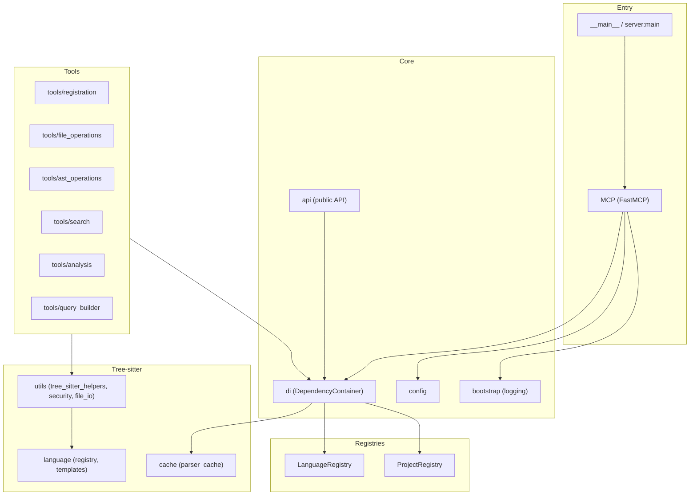

# MCP Tree-sitter Server — Repository Overview

## What It Is

An **MCP (Model Context Protocol) server** that gives AI assistants (e.g. Claude Desktop) **code analysis** over a codebase using **tree-sitter**: AST parsing, symbol extraction, search, dependencies, complexity. Python 3.10+, uses `tree-sitter` and `tree-sitter-language-pack` for many languages.

---

## High-Level Structure

- **Entry:** `server.py` (FastMCP), `__main__.py` → `mcp-server-tree-sitter` CLI.
- **Core:** Bootstrap (logging), config (YAML + env), DI container, public `api`.
- **Registries:** Projects and languages (singletons via DI).
- **Tree-sitter:** Parser cache, language registry + query templates, helpers, security, file I/O.
- **Tools:** MCP tools for registration, files, AST, search, analysis, query building.

---

## Features (Summary)

| Area                          | Status   | Notes                                                                          |
|-------------------------------|----------|--------------------------------------------------------------------------------|
| Project / language / file ops | ✅        | register, list, remove project; list files, get file, metadata                 |
| AST                           | ✅        | get_ast, get_node_at_position; cursor-based traversal                          |
| Search & queries              | ✅        | find_text, run_query; query templates, build, adapt, get_node_types            |
| Symbols & analysis            | ✅        | get_symbols, find_usage, get_dependencies, analyze_project, analyze_complexity |
| Similar code                  | ⚠️       | find_similar_code runs but often returns no results                            |
| Config & cache                | ✅        | configure, clear_cache, diagnose_config; parse tree caching                    |
| MCP context / progress        | ⚠️       | Context works; progress reporting not fully done                               |
| Tree editing / incremental    | ⚠️       | Partial; full tree edit + incremental parsing not complete                     |
| UTF-16 / read callable        | ❌        | Not implemented                                                                |
| Image handling                | ❌        | Not implemented                                                                |

**Languages:** See [Supported languages](#supported-languages) and [Adding more languages](#adding-more-languages) below.

---

## Supported languages

Parsers come from **tree-sitter-language-pack**. Support is in two tiers:

**Full support** (symbol extraction, built-in query templates, `get_symbols`, `get_dependencies`, etc.):  
Python, JavaScript, TypeScript, Go, Rust, C, C++, Swift, Java, Kotlin, Julia, APL.

**Parser-only** (AST and `run_query` with your own queries; no built-in symbol/import templates):  
Ruby, C#, PHP, Scala, Lua, Haskell, OCaml, Bash, YAML, JSON, Markdown, HTML, CSS, SCSS, SQL, Protobuf, Elm, Clojure, Elixir, Objective-C, XML (and any other language provided by tree-sitter-language-pack once mapped).

File extension → language is defined in `LanguageRegistry._language_map` in `src/mcp_server_tree_sitter/language/registry.py` (e.g. `py` → `python`, `rs` → `rust`). Call `list_languages` to see what the server reports as available.

---

## Adding more languages

### Parser-only (AST + custom queries)

1. Ensure the language is provided by **tree-sitter-language-pack** (see its docs).
2. In `src/mcp_server_tree_sitter/language/registry.py`, add entries to `LanguageRegistry._language_map`: `"extension": "language_id"` (e.g. `"rb": "ruby"`). The language will then be detected from file extension and you can use `get_ast` and `run_query` with custom query strings.

### Full support (symbol extraction, templates)

1. Do the parser-only steps above so the language is detected.
2. **Add a template module:** create `src/mcp_server_tree_sitter/language/templates/<lang>.py` (e.g. `ruby.py`) with a `TEMPLATES` dict. Keys are template names (e.g. `"functions"`, `"classes"`, `"imports"`); values are tree-sitter query strings. Copy an existing language (e.g. `python.py`) and adapt node types to the grammar.
3. **Register templates:** in `src/mcp_server_tree_sitter/language/templates/__init__.py`, import the new module and add `"language_id": module.TEMPLATES` to the `QUERY_TEMPLATES` dict.
4. **Optional:** in `src/mcp_server_tree_sitter/tools/query_builder.py`, extend `describe_node_types()` with that language so `get_node_types` returns descriptions.

Analysis tools (`get_symbols`, `get_dependencies`, `analyze_complexity`) use these templates and language-specific defaults in `tools/analysis.py` (e.g. `extract_symbols` symbol_types per language).

---

## Quick test of the MCP service

- **Unit tests:**  
  `make test` or `uv run pytest tests` (from repo root; `PYTHONPATH` set by Makefile). Use `make test-all` to include diagnostic tests.

- **Run the server (stdio):**  
  `make mcp-run` or, after install, `mcp-server-tree-sitter`. Pass `ARGS="--help"` or `ARGS="--debug"` with make. Useful to confirm the process starts and responds to MCP over stdio.

- **Interactive test with MCP Inspector:**  
  `make mcp-dev`. This opens the MCP Inspector UI so you can call tools by name (e.g. `register_project_tool`, `list_files`, `get_ast`, `get_symbols`). Steps: run `make mcp-dev`, register a project with a real path, then try `list_files`, `get_file`, `get_ast`, etc.  
  *Note: The MCP CLI expects a Python **file** path, not a module name. The Makefile uses the launcher `run_mcp_server.py:mcp` so that `mcp dev` and `mcp run` work from the repo root.*

- **One-off tool check:**  
  Run tests that hit the tools, e.g. `uv run pytest tests/test_registration.py tests/test_file_operations.py tests/test_ast_cursor.py -v`.

---

## What Is Tested

- **Unit tests:** `tests/` — many modules (registration, file ops, AST, symbols, search, config, logging, DI, server, diagnostics, etc.). Pytest; `conftest.py` resets project registry per test and loads the diagnostic plugin.
- **Diagnostics:** `tests/test_diagnostics/` — AST, cursor, language pack, registry, unpacking; marked with `diagnostic` marker.
- **CI (`.github/workflows/ci.yml`):** Python 3.12, install via `uv` and `uvx`; runs **ruff check**, **ruff format --check**, **mypy** on `src`, **pytest tests** and **pytest tests/test_diagnostics/**. Diagnostic artifacts go to `diagnostic_results/` (ignored).
- **Coverage:** Not enforced to 100%; ROADMAP targets increasing coverage and enforcing in CI.

---

## What Is Missing or In Progress

- **Similar code:** Fix `find_similar_code` so it returns results reliably; tune thresholds and add tests.
- **Tree editing / incremental parsing:** Full tree edit API and incremental parsing after edits.
- **MCP progress:** Complete progress reporting for long-running ops.
- **UTF-16:** Encoding detection and UTF-16 support.
- **Read callable / streaming:** Custom read strategies for very large files.
- **Quality / process:** 100% type coverage, docstring coverage, integration tests, feature flags (allow/block list) for server capabilities.
- **Docs:** user-guide, api-guide, tutorials (some WIP). Many medium/long-term items are HOLD in ROADMAP.
