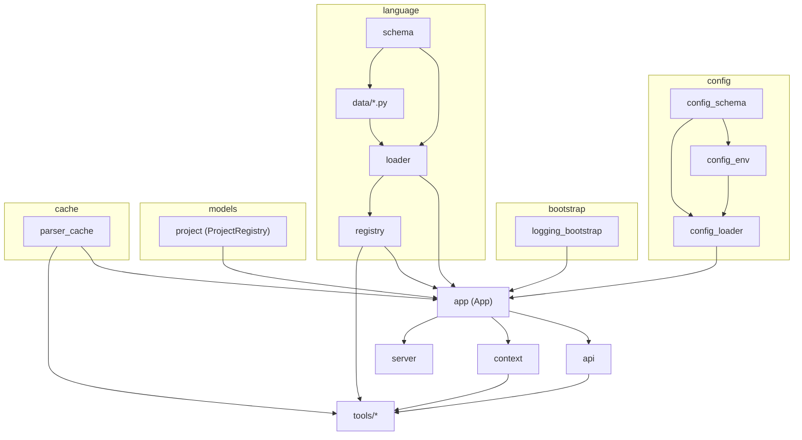

# Architecture Overview

This document describes the MCP Tree-sitter Server architecture: shared app state lifecycle, module dependencies, thread-safety, configuration precedence, and the language data loading pipeline.

## Shared App State (App Singleton)

The server uses a single process-wide **App** instance as the container for all shared state. Access it via `get_app()`.

### Lifecycle

1. **First access**  
   When any code first calls `get_app()` (or `App()`), the singleton is created under a class-level `threading.RLock`. Only one thread creates the instance; others block until creation is done.

2. **Initialization (once per process)**  
   `App.__init__` runs only once (guarded by `_initialized` and `_initializing` to avoid re-entrancy):
   - **ConfigurationManager** is created; config is loaded from defaults, then optionally from YAML and environment (see [Config precedence](#config-precedence)).
   - **ProjectRegistry** singleton is created (projects in memory for the process lifetime).
   - **Language data** is loaded via `load_all_language_data()` (see [Language data loading pipeline](#language-data-loading-pipeline)).
   - **LanguageRegistry** is created with preferred languages from config.
   - **TreeCache** is created with cache settings from config.
   - An **on_config_loaded** callback is registered so that when config is reloaded or updated, cache settings and log levels are applied.

3. **Runtime**  
   The same `App` instance is used for all MCP requests. Config can be updated at runtime via `ConfigurationManager.update_value()` or `load_from_file()`; the callback keeps cache and logging in sync.

4. **Process exit**  
   No explicit shutdown hook; when the process exits, all state is discarded. There is one App instance per process (e.g. one per MCP server process).

### What lives on App

| Attribute            | Type                 | Purpose                                      |
|----------------------|----------------------|----------------------------------------------|
| `config_manager`     | ConfigurationManager  | Load/update config, env, YAML, callbacks     |
| `project_registry`   | ProjectRegistry      | Registered project roots and file lists      |
| `language_registry`  | LanguageRegistry     | Tree-sitter parsers and language metadata    |
| `tree_cache`         | TreeCache            | Cache of parsed trees (path + language + mtime) |

Helpers: **api** (`get_config`, `get_project_registry`, etc.) and **context** (`ServerContext`, `global_context`) both use `get_app()` under the hood.

---

## Module Dependency Graph

High-level dependency flow (excluding tests):

- **Bootstrap** (logging) has no internal app dependencies and is used by everyone.
- **App** depends on: bootstrap, config, cache, language (registry + loader), models (ProjectRegistry).
- **API / Context** depend on App.
- **Tools** (MCP tools) depend on api/context, cache, language, utils.
- **Server** (FastMCP) depends on App, config, and tools.



**ASCII alternative:**

```
                    ┌─────────────────┐
                    │   bootstrap     │
                    │ (logging only)  │
                    └────────┬────────┘
                             │
    ┌────────────┐    ┌──────┴──────┐    ┌─────────────┐
    │  config_*  │    │     app     │    │ language/   │
    │ (schema,   │───►│ (singleton) │◄───│ loader,     │
    │  env,      │    │             │    │ registry,   │
    │  loader)   │    │ - config_mgr│    │ data/*)     │
    └────────────┘    │ - projects  │    └─────────────┘
                      │ - languages │    ┌──────────────┐
    ┌────────────┐    │ - tree_cache│◄───│ cache/       │
    │ models/    │───►│             │    │ parser_cache │
    │ project    │    └──────┬──────┘    └──────────────┘
    └────────────┘           │
                    ┌────────┴────────┐
                    │  api, context   │
                    │  server, tools  │
                    └─────────────────┘
```

---

## Thread-Safety Guarantees

- **App singleton**: Creation is guarded by `App._lock` (`threading.RLock`). First call creates the instance; concurrent callers block until creation and initialization complete. After that, `__init__` is skipped.

- **ProjectRegistry**: Also a `__new__`-based singleton with a class-level `threading.RLock`. Registration and lookup use this lock.

- **TreeCache**: Uses an instance-level `threading.RLock` for all get/set/invalidate operations.

- **ConfigurationManager**: The in-memory config object is mutable. Updates (`update_value`, `load_from_file`) are not atomic with respect to readers. In practice the MCP server is single-threaded per request; if you introduce multi-threaded config writers, consider adding a lock.

- **LanguageRegistry / LanguageDataLoader**: Language data is loaded once at startup (during App init). The loader uses class-level caches populated before any request handling; no locking is used for reads. Do not reload language data concurrently with reads.

**Summary**: Singleton creation and shared mutable state (projects, cache) are thread-safe. Config and language data are safe for typical single-threaded MCP usage; for custom multi-threaded use, document or add locking where needed.

---

## Config Precedence

Configuration is merged from multiple sources. **Highest to lowest precedence:**

1. **Explicit updates** — `ConfigurationManager.update_value()` (and any code that calls it, e.g. configure tool). These take effect immediately and are **not** overwritten by env or file when you load config later.

2. **Environment variables** — All `MCP_TS_*` variables. Applied **at load time only** (when the config object is created or when a YAML file is loaded). They do not re-apply on every read; so once you use `update_value()`, that value wins until you load from file again (which re-applies env over the file).

3. **YAML file** — Values from the config file when present (e.g. `~/.config/tree-sitter/config.yaml` or path from `MCP_TS_CONFIG_PATH` or passed to `load_from_file()`).

4. **Defaults** — `ServerConfig` / schema defaults (e.g. in `config_schema.py`).

**Config file path resolution** (for `load_config()` or default load): explicit path argument &gt; `MCP_TS_CONFIG_PATH` env &gt; platform default path (e.g. `~/.config/tree-sitter/config.yaml`). Only existing, non-empty files are loaded; then env is applied on top of the loaded values.

---

## Language Data Loading Pipeline

Language metadata (extensions, scope node types, query templates, etc.) is loaded once per process during **App** initialization.

1. **Trigger**  
   `App.__init__` calls `load_all_language_data()` (from `language.loader`).

2. **Discovery**  
   `LanguageDataLoader.load_all_language_data()` imports the package `mcp_server_tree_sitter.language.data` and uses `pkgutil.iter_modules()` to import every module in that package (e.g. `python.py`, `javascript.py`).

3. **Registration**  
   Each module defines a class that subclasses `LanguageDataBase` (in `language.schema`). Subclasses register themselves via `__init_subclass__` in the base. So importing the module is enough to register the class.

4. **Build**  
   The loader iterates `LanguageDataBase.registered_subclasses()`, calls `to_language_data()` on each, and builds a dict `language_id -> LanguageData`. This dict is cached on the loader class.

5. **Derived caches**  
   From that dict, the loader builds and caches:
   - Scope node types (by kind: function/class/module)
   - Extension → language id map
   - Query templates, node type descriptions
   - Query adaptation map (if present)

6. **Use**  
   `LanguageRegistry` is then created (with config’s preferred languages). The registry uses the already-loaded language data and tree-sitter grammars to provide parsers and language info to tools.

**Important**: Language data is loaded before `LanguageRegistry` is constructed. Adding a new language requires adding a new module under `language/data/` and implementing the `LanguageDataBase` contract; no separate registration step is needed. See [Adding a new language](troubleshooting.md#adding-a-new-language) in the troubleshooting guide.

---

## Other Design Notes

- **Bootstrap**: Logging and other minimal init live in `bootstrap/` and are imported early from the package `__init__.py` so all modules can use `get_logger()` and consistent log levels.

- **Errors**: Custom exceptions live in `exceptions.py` (e.g. `LanguageError`, `ProjectError`, `QueryError`). Tools and API layers map these to MCP responses or re-raise as appropriate.

- **Lifecycle**: Bootstrap → Config load → App init (config, projects, language data, language registry, cache, config callback) → Server setup (FastMCP, tools) → Request handling. No formal shutdown hook; process exit drops all state.

For configuration file format and options, see [Configuration Guide](config.md). For runtime issues and debugging, see [Troubleshooting](troubleshooting.md).
